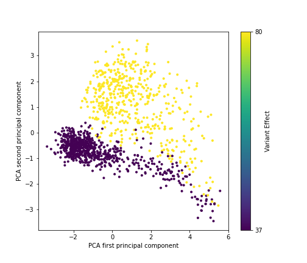
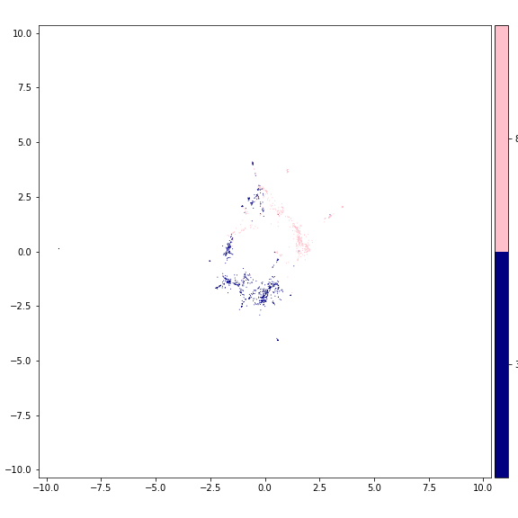

# Protein Classificator

## Prerequisites

- Python3 (tested on Python 3.7.4)
- [ESM](https://github.com/facebookresearch/esm) (v0.4.0)
- [PyMDE](https://github.com/cvxgrp/pymde) (v0.1.13)

## Primary dataset for training

Firstly, proteomes of *Escherichia coli* (ECOLI) (https://www.uniprot.org/proteomes/UP000000625) and *Sulfolobus solfataricus* (SACS2) (https://www.uniprot.org/proteomes/UP000001974) were taken to train the model. Due to the growth conditions of each organism, *E. coli* was taken as a representative of mesophiles, assuming that the optimal conditions for its protein functionality is around 37 degrees Celsius (Jang et al. 2017). Meanwhile, *S. solfataricus* - a thermophile - has a proteome consisting of proteins, which have optimal conditions of 80 degrees Celsius (Zaparty et al. 2010).  The datasets consisted of 4392 and 2938 proteins for *E. coli* and *S. solfataricus* respectively. 

## Usage of protein embedding

Embedding is a technique to mapping from words to vectors, which allow to do a more convenient analysis in the model. Neural networks use embeddings to reduce the number of dimensions of categorical variables and meaningfully represent categories in the transformed space.

A couple of software tools to make embeddings were checked: `bio_embeddings` (Dallago et al. 2021) and a script to extract embeddings from Evolutionary Scale Modeling (ESM) (Rives et al. 2021).  The latter one was chosen to accomplish this task for our case of protein sequences. 

The following command was run to generate embeddings for the training dataset. The analogical commands were run for validation and testing datasets.

```
python3 extract.py esm1b_t33_650M_UR50S data/FASTA/training_sequences.fasta data/EMB_ESM1b/training_sequences/ --repr_layers 0 32 33 --include mean per_tok
```

Since embeddings took up a lot of storage space (~23 GB for training dataset and ~5 GB for each validation and testing sets), they were moved from the local storage to OneDrive.

## Removal of duplicated sequences

Initially generated sequences files were not taken as input to the embedding tool, since FASTA file that was run to try embedding included several sequences that had duplicates by the sequence. Therefore, the data parsing part was edited by removing encountered duplicates. There were 42 sequences removed from the initial dataset changing the overall number of sequences to 7288.

## Filtering sequences by length

The script to generate embeddings for our protein sequences did not process sequences that were longer than 1024 aminoacids. The visualisation package PyMDE required the embeddings to have the respective representation of each sequence in FASTA, therefore filtered FASTA files were generated.

1. The list of embeddings (PT format files named by the FASTA sequence ID) were listed down with command:

```
ls -1 > data/EMB_ESM1b/training_embeddings.lst
ls -1 > data/EMB_ESM1b/validation_embeddings.lst
ls -1 > data/EMB_ESM1b/testing_embeddings.lst
```

2. For the training dataset, due to the limitations of storage, only the sample of the set was taken. 

The size of the sample was set to be one quarter of the training dataset. 

The command that was run to get the number of all embeddings: 

```
ls -1 | wc -l
```

The output of the command was 5056 (at Mon Nov 15 15:26:47 CET 2021).

The command that was run to get the random sample of the training sequence list:

```
ls -1 | shuf -n 1264 > data/EMB_ESM1b/training_embeddings_sample.lst
```

The embedding files that were required for visualisation were picked with with command:

```
cat data/EMB_ESM1b/training_embeddings_sample.lst | xargs -I % cp % data/EMB_ESM1b/training_embeddings_sample/%
```

Those embeddings files were uploaded to Google Drive to access from Google Colab notebook.

3. Picking the FASTA sequences that had the generated embeddings and putting these sequences into the filtered FASTA files. The creation of filtered FASTA files was done in the `classificator.ipynb`.

## Visualisation of the dataset

The visualisation of the initial dataset was performed for a random sample of training dataset, and full sets of validation and testing. The visualisation was performed using two methods: PCA with `matplotlib.pyplot` package and PyMDE.

 

**Fig. 1.** PCA plot made with matplotlib of the training dataset sample embeddings

 

**Fig. 2.** Minimum-distortion embedding plot of the training dataset sample embeddings

The visualisation (Fig. 1. and Fig. 2.) of the dataset showed a significant distinction between the thermophilic and mesophilic prokaryote proteins. However, since the chosen prokaryotes were different not only in the living conditions, yet also they differed in their domains: *E. coli* belongs to bacteria domain, meanwhile *S. solfataricus* is an archaeon species. Therefore it was decided to make additional visualisations for mesophilic archaea and thermophilic bacteria proteomes.

## Analysis of the data clusters

Mesophilic archaea:
- *Methanobrevibacter oralis* (9EURY) [UP000077428](https://www.uniprot.org/proteomes/UP000077428)
- *Nitrosopumilus maritimus* (strain SCM1) (NITMS) [UP000000792](https://www.uniprot.org/proteomes/UP000000792)

Thermophilic bacteria:
- *Aquifex aeolicus* (strain VF5) (AQUAE) [UP000000798](https://www.uniprot.org/proteomes/UP000000798)
- *Thermotoga maritima* (strain ATCC 43589 / DSM 3109 / JCM 10099 / NBRC 100826 / MSB8) (THEMA) [UP000008183](https://www.uniprot.org/proteomes/UP000008183)

In order to check whether the clusterization in the primary dataset occurred due to the domain of the organism or the thermophilic properties of each protein, four cases of tests were performed: two to expect the positive result (clusterization effect into two groups resembling the initial plot) and other two with an expectation to observe the negative result - no distinctive classes.

Samples for positive tests:
- [x] 001. Sample containing mesophilic (UP000000625) and thermophilic bacteria (UP000000798, UP000008183).
- [x] 002. Sample containing mesophilic (UP000077428, UP000000792) and thermophilic (UP000001974) archaea.

Samples for negative tests:
- [x] 003. Sample containing thermophilic bacteria (UP000000798, UP000008183) and archaea (UP000001974).
- [x] 004. Sample containing mesophilic bacteria (UP000000625) and archaea (UP000077428, UP000000792).

In (py37) conda environment:
```
python3 esm/extract.py esm1b_t33_650M_UR50S data/cluster_tests/004/FASTA/004.fasta data/cluster_tests/004/EMB_ESM1b/ --repr_layers 0 32 33 --include mean per_tok
```

```
python3 scripts/positive_test.py
python3 scripts/negative_test.py
```

## Usage of evolutionary scale modeling

Transformer protein language models from Facebook AI Research (Rives et al. 2019).

## Construction of the model

General logic of the workflow:

- Define the model in the separate module (loss function currently is defined separately - right before the beginning of the training).
- Load training and validation datasets (pregenerated embeddings).
- Define BATCH_SIZE and NUM_OF_EPOCHS (according to number of data elements).
- If needed, trim the dataset so that it would be the size of BATCH_SIZE multiple (function for that can be found in `scripts/model_dataset_processing.py`).
- Convert labels to binary (function for that can be found in `scripts/model_dataset_processing.py`).
- Pass processed datasets to `DataLoader`.
- Initialize the defined model.
- Set loss function and optimizer.
- Run epochs with training and validation functions (found in `scripts/model_flow.py`).

### Single-layer perceptron

The simplest model was composed of one linear layer that takes up all 1280 values from embeddings vector. The activation function was chosen to be sigmoid, since it is compatible with binary cross entropy loss function. 

There were two alternatives applied: 
- Sigmoid activation and BCE loss functions were called separately
- BCEWithLogitsLoss function that wraps Softmax and BCE loss functions together. According to ... this alternative is more stable than the previous one.

The whole workflow will be in `scripts/classificator.py`.
Data processing functions are placed in `scripts/model_dataset_processing.py`.

#### Dataset for SLP testing

The first results (ROC curves) of SLP trained with two proteomes [*Escherichia coli* (ECOLI)](https://www.uniprot.org/proteomes/UP000000625) and [*Sulfolobus solfataricus* (SACS2)](https://www.uniprot.org/proteomes/UP000001974) were showed high accuracy of prediction, therefore it was decided to test the model with a different set of organisms that would contain more diverse species regarding the temperature that is optimal for the organism.

The sequences were taken from the [database](https://zenodo.org/record/1175609#.YcCVhS8Rq4o) (Engqvist, Martin Karl Magnus 2018) of growth temperatures of 21 498 organisms. It was decided to split the dataset to mesophiles and thermophiles and take 70%:15%:15% proportions for the datasets required to develop the model. Organisms that were considered as thermophiles
were those that had growth temperature label equal or higher than 65 degrees Celsius.

Counting how many proteomes belong to thermophiles:

```
$ > tail -n +2 data/proteomes/temperature_data.tsv | awk ' $3 >= 65 { print $3 }' | wc -l
283
```


## Tasks to do

- [x] Extract UniProt accession numbers from initial FASTA files.
- [x] Create FASTA files `*_sequences.fasta` which records contain only UniProt accession numbers in the header.
- [x] Create `*_temperature_annotations.csv` files that contain identifier and temperature labels.
- [x] Set up `config.yml` file to use the embedding.
- [x] Try evolutionary scale modeling (generation of embeddings).
- [x] Visualise generated embeddings for a random sample of training dataset.
- [x] Visualise generated embeddings for validation dataset.
- [x] Visualise generated embeddings for testing dataset.
- [x] Remove variant effect scale from the PCA visualisation.
- [x] Separate modules in `classificator.ipynb` for an easier usage of its functionalities in the future.
- [x] Construct a simple neural network (a single layer perceptron).
- [x] Create mesophilic archaea and thermophilic bacteria embeddings.
- [x] Visualise mesophilic archaea and thermophilic bacteria embeddings.
- [ ] Determine the species that are taken into PyMDE for visualisation automatically.
- [x] Determine the order of species that are taken into PyMDE for visualisation (answer: alphabetical order).
- [x] Construct a simple neural network (a single layer perceptron) with tools from PyTorch package.
- [ ] Construct another simple neural network (with a single hidden layer 1DCNN, RELU) with a softmax activation function as an output. 
- [x] Automate model training process and separate modules to make the process adaptive to different architectures.
- [ ] Include loss functions in the definition of the model.
- [x] Include ROC curve graphing.
- [ ] Include drawing of confusion matrices.
- [ ] Generate a new training and validation set from the [microorganism dataset](https://zenodo.org/record/1175609#.YbtlfC8RpQJ) with growth temperature annotations.
- [ ] Train and validate SLP with a new generated training and validation set.

## References

1. Dallago, C., Schütze, K., Heinzinger, M., Olenyi, T., Littmann, M., Lu, A. X., Yang, K. K., Min, S., Yoon, S., Morton, J. T., & Rost, B. 2021. "Learned embeddings from deep learning to visualize and predict protein sets." *Current Protocols*, 1, e113. https://doi.org/10.1002/cpz1.113. 

2. Jang, J., Hur, H. G., Sadowsky, M. J., Byappanahalli, M. N., Yan, T., & Ishii, S. 2017. "Environmental Escherichia coli: ecology and public health implications—a review." *Journal of applied microbiology*, 123(3), 570-581. https://doi.org/10.1111/jam.13468.

3. Rives, A., Meier, J., Sercu, T., Goyal, S., Lin, Z., Liu, J., ... & Fergus, R. 2021. "Biological structure and function emerge from scaling unsupervised learning to 250 million protein sequences." *Proceedings of the National Academy of Sciences*, 118(15). https://doi.org/10.1073/pnas.2016239118.

4. Zaparty, M., Esser, D., Gertig, S., Haferkamp, P., Kouril, T., Manica, A., ... & Siebers, B. 2010. "'Hot standards' for the thermoacidophilic archaeon Sulfolobus solfataricus." Extremophiles, 14(1), 119-142. https://doi.org/10.1007/s00792-009-0280-0.

5. Engqvist, Martin Karl Magnus. 2018. "Growth temperatures for 21,498 microorganisms (1.0.0)" [Data set]. Zenodo. https://doi.org/10.5281/zenodo.1175609

6. Engqvist, M. K. 2018. "Correlating enzyme annotations with a large set of microbial growth temperatures reveals metabolic adaptations to growth at diverse temperatures." *BMC microbiology*, 18(1), 1-14. https://doi.org/10.1186/s12866-018-1320-7.

