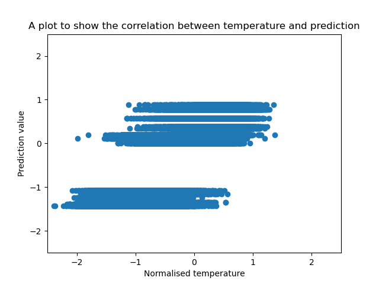
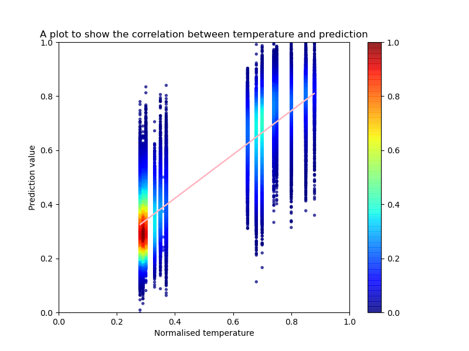

# Protein Classificator

## Prerequisites

- Python3 (tested on Python 3.7.4)
- [ESM](https://github.com/facebookresearch/esm) (v0.4.0)
- [PyMDE](https://github.com/cvxgrp/pymde) (v0.1.13)

## Primary dataset (001) for training

Firstly, proteomes of *Escherichia coli* (ECOLI, [UP000000625](https://www.uniprot.org/proteomes/UP000000625)) and *Sulfolobus solfataricus* (SACS2, [UP000001974](https://www.uniprot.org/proteomes/UP000001974)) were taken to train the model. Due to the growth conditions of each organism, *E. coli* was taken as a representative of mesophiles, assuming that the optimal conditions for its protein functionality is around 37 degrees Celsius (Jang et al. 2017). Meanwhile, *S. solfataricus* - a thermophile - has a proteome consisting of proteins, which have optimal conditions of 80 degrees Celsius (Zaparty et al. 2010).  The datasets consisted of 4392 and 2938 proteins for *E. coli* and *S. solfataricus* respectively. 

## Usage of protein embedding

Embedding is a technique to mapping from words to vectors, which allow to do a more convenient analysis in the model. Neural networks use embeddings to reduce the number of dimensions of categorical variables and meaningfully represent categories in the transformed space.

A couple of software tools to make embeddings were checked: `bio_embeddings` (Dallago et al. 2021) and a script to extract embeddings from Evolutionary Scale Modeling (ESM) (Rives et al. 2021).  The latter one was chosen to accomplish this task for our case of protein sequences. 

The following command was run to generate embeddings for the training dataset. The analogical commands were run for validation and testing datasets.

```
python3 extract.py esm1b_t33_650M_UR50S data/001/FASTA/training_sequences.fasta data/001/EMB_ESM1b/training_sequences/ --repr_layers 0 32 33 --include mean per_tok
```

Since embeddings took up a lot of storage space (~23 GB for training dataset and ~5 GB for each validation and testing sets), they were moved from the local storage to OneDrive.

## Removal of duplicated sequences

Initially generated sequences files were not taken as input to the embedding tool, since FASTA file that was run to try embedding included several sequences that had duplicates by the sequence. Therefore, the data parsing part was edited by removing encountered duplicates. There were 42 sequences removed from the initial dataset changing the overall number of sequences to 7288.

## Filtering sequences by length

The script to generate embeddings for our protein sequences did not process sequences that were longer than 1024 aminoacids. The visualisation package PyMDE required the embeddings to have the respective representation of each sequence in FASTA, therefore filtered FASTA files were generated.

1. The list of embeddings (PT format files named by the FASTA sequence ID) were listed down with command:

```
ls -1 > data/001/EMB_ESM1b/training_embeddings.lst
ls -1 > data/001/EMB_ESM1b/validation_embeddings.lst
ls -1 > data/001/EMB_ESM1b/testing_embeddings.lst
```

2. For the training dataset, due to the limitations of storage, only the sample of the set was taken. 

The size of the sample was set to be one quarter of the training dataset. 

The command that was run to get the number of all embeddings: 

```
ls -1 | wc -l
```

The output of the command was 5056 (at Mon Nov 15 15:26:47 CET 2021).

The command that was run to get the random sample of the training sequence list:

```
ls -1 | shuf -n 1264 > data/001/EMB_ESM1b/training_embeddings_sample.lst
```

The embedding files that were required for visualisation were picked with with command:

```
cat data/001/EMB_ESM1b/training_embeddings_sample.lst | xargs -I % cp % data/EMB_ESM1b/training_embeddings_sample/%
```

Those embeddings files were uploaded to Google Drive to access from Google Colab notebook.

3. Picking the FASTA sequences that had the generated embeddings and putting these sequences into the filtered FASTA files. The creation of filtered FASTA files was done in the `classificator.ipynb`.

## Visualisation of the dataset

The visualisation of the initial dataset was performed for a random sample of training dataset, and full sets of validation and testing. The visualisation was performed using two methods: PCA with `matplotlib.pyplot` package and PyMDE.

 

**Fig. 1.** PCA plot made with matplotlib of the training dataset sample embeddings

 

**Fig. 2.** Minimum-distortion embedding plot of the training dataset sample embeddings

The visualisation (Fig. 1. and Fig. 2.) of the dataset showed a significant distinction between the thermophilic and mesophilic prokaryote proteins. However, since the chosen prokaryotes were different not only in the living conditions, yet also they differed in their domains: *E. coli* belongs to bacteria domain, meanwhile *S. solfataricus* is an archaeon species. Therefore it was decided to make additional visualisations for mesophilic archaea and thermophilic bacteria proteomes.

## Analysis of the data clusters

Mesophilic archaea:
- *Methanobrevibacter oralis* (9EURY) [UP000077428](https://www.uniprot.org/proteomes/UP000077428)
- *Nitrosopumilus maritimus* (strain SCM1) (NITMS) [UP000000792](https://www.uniprot.org/proteomes/UP000000792)

Thermophilic bacteria:
- *Aquifex aeolicus* (strain VF5) (AQUAE) [UP000000798](https://www.uniprot.org/proteomes/UP000000798)
- *Thermotoga maritima* (strain ATCC 43589 / DSM 3109 / JCM 10099 / NBRC 100826 / MSB8) (THEMA) [UP000008183](https://www.uniprot.org/proteomes/UP000008183)

In order to check whether the clusterization in the primary dataset occurred due to the domain of the organism or the thermophilic properties of each protein, four cases of tests were performed: two to expect the positive result (clusterization effect into two groups resembling the initial plot) and other two with an expectation to observe the negative result - no distinctive classes.

Samples for positive tests:
- [x] 001. Sample containing mesophilic (UP000000625) and thermophilic bacteria (UP000000798, UP000008183).
- [x] 002. Sample containing mesophilic (UP000077428, UP000000792) and thermophilic (UP000001974) archaea.

Samples for negative tests:
- [x] 003. Sample containing thermophilic bacteria (UP000000798, UP000008183) and archaea (UP000001974).
- [x] 004. Sample containing mesophilic bacteria (UP000000625) and archaea (UP000077428, UP000000792).

In (py37) conda environment:
```
python3 esm/extract.py esm1b_t33_650M_UR50S data/cluster_tests/004/FASTA/004.fasta data/cluster_tests/004/EMB_ESM1b/ --repr_layers 0 32 33 --include mean per_tok
```

```
python3 scripts/positive_test.py
python3 scripts/negative_test.py
```

The output (plots) for these cluster tests were put to `data/cluster_tests/visualisation` directory.

## Usage of evolutionary scale modeling

Transformer protein language models from Facebook AI Research (Rives et al. 2019).

## Construction of the model

General logic of the workflow:

- Define the model in the separate module (loss function currently is defined separately - right before the beginning of the training).
- Load training and validation datasets (pregenerated embeddings).
- Define BATCH_SIZE and NUM_OF_EPOCHS (according to number of data elements).
- If needed, trim the dataset so that it would be the size of BATCH_SIZE multiple (function for that can be found in `scripts/model_dataset_processing.py`).
- Convert labels to binary (function for that can be found in `scripts/model_dataset_processing.py`).
- Pass processed datasets to `DataLoader`.
- Initialize the defined model.
- Set loss function and optimizer.
- Run epochs with training and validation functions (found in `scripts/model_flow.py`).

### Single-layer perceptron

The simplest model was composed of one linear layer that takes up all 1280 values from the embeddings vector. The activation function was chosen to be sigmoid, since it is compatible with binary cross entropy loss function. 

There were two alternatives applied: 
- Sigmoid activation and BCE loss functions were called separately
- BCEWithLogitsLoss function that wraps sigmoid and BCE loss functions together. According to [Runebook.dev](https://runebook.dev/en/docs/pytorch/generated/torch.nn.bcewithlogitsloss), this alternative is more stable than the previous one.

The whole workflow will be in `scripts/classificator.py`.
Data processing functions are placed in `scripts/model_dataset_processing.py`.

### Dataset for SLP testing (002)

The first results (ROC curves) of SLP trained with two proteomes [*Escherichia coli* (ECOLI)](https://www.uniprot.org/proteomes/UP000000625) and [*Sulfolobus solfataricus* (SACS2)](https://www.uniprot.org/proteomes/UP000001974) were showed high accuracy of prediction, therefore it was decided to test the model with a different set of organisms that would contain more diverse species regarding the temperature that is optimal for the organism.

All files required for this dataset are placed in `data/002` directory. 

The sequences were taken from the [database](https://zenodo.org/record/1175609#.YcCVhS8Rq4o) (Engqvist, Martin Karl Magnus 2018) of growth temperatures of 21 498 organisms. It was decided to split the dataset to mesophiles and thermophiles and take 70%:15%:15% proportions for the datasets required to develop the model. Organisms that were divided into two groups: 
with temperature labels equal to 65 or above, and the group of organisms with temperature labels below (psychrophiles and mesophiles). 

The number of records in the dataset:
```
tail -n +2 data/002/TSV/temperature_data.tsv | wc -l
21498
```

Counting how many proteomes belong to thermophiles:
```
tail -n +2 data/002/TSV/temperature_data.tsv | awk '$3 >= 65 { print $3 }' | wc -l
283
```

Sorting, shuffling and saving the separate datasets:
```
tail -n +2 data/002/TSV/temperature_data.tsv | sort -k3 -n | head -n 21215 | gshuf > data/002/TSV/below_65_temperature_data.tsv
tail -n +2 data/002/TSV/temperature_data.tsv | sort -k3 -n | tail -n 283 | gshuf > data/002/TSV/above_65_temperature_data.tsv
```

Creating a training dataset:
```
cat data/002/TSV/below_65_temperature_data.tsv | head -n 14850 > data/002/TSV/training_temperature_data.tsv
cat data/002/TSV/above_65_temperature_data.tsv | head -n 198 >> data/002/TSV/training_temperature_data.tsv
```

Creating a validation dataset:
```
cat data/002/TSV/below_65_temperature_data.tsv | tail -n +14851 | head -n 3182 > data/002/TSV/validation_temperature_data.tsv
cat data/002/TSV/above_65_temperature_data.tsv | tail -n +199 | head -n 42 >> data/002/TSV/validation_temperature_data.tsv
```

Creating a testing dataset:
```
cat data/002/TSV/below_65_temperature_data.tsv | tail -n +18033 > data/002/TSV/testing_temperature_data.tsv
cat data/002/TSV/above_65_temperature_data.tsv | tail -n +241 >> data/002/TSV/testing_temperature_data.tsv
```

Each of the datasets require shuffling before usage in the model flow.

Since computational resources were limited, around 10 percent of proteomes could be downloaded. That was (expected):
- 1500 protein sequences from each organism in `data/002/TSV/training_temperature_data.tsv`
- 330 protein sequences from each organism in `data/002/TSV/validation_temperature_data.tsv`
- 330 protein sequences from each organism in `data/002/TSV/testing_temperature_data.tsv`

There was only 1 sequence taken from each organism (it was expected to get at least one sequence for an organism, since not all organisms had records in NCBI `protein` database). Since our model's predictions should not be biased by an organism,
thus it was assumed that this sample size should not be unsuitable for the task that is solved. 

Protein sequences were downloaded using the script `scripts/data_download/download_proteins_by_TaxID.sh` that uses `efetch 14.6`. The script requires improvement so that it would take `DATASET_FILE` and `INPUT_DIR` as command line arguments.

In order to use the flow described below, the initial dataset should be defined in the TSV file with required fields:
- $1 - name of organism species
- $2 - domain of an organism (not mandatory to be specified precisely)
- $3 - temperature label
- $4 - taxonomy ID of an organism

Alternatively, the dataset can be presented as a multiple FASTA file with headers in the format:
```
>organism_tax_id|protein_ID|temperature_label
```

If datasets are placed in separate training, validation and testing FASTA files, the flow can be started from the 4th point (embeddings generation). 

The steps for testing with 002 dataset:

1. Download training, validation, testing sets with:
```
./scripts/data_download/download_proteins_by_TaxID.sh data/002/TSV/training_temperature_data.tsv data/002/FASTA/training/ 1500
./scripts/data_download/download_proteins_by_TaxID.sh data/002/TSV/validation_temperature_data.tsv data/002/FASTA/validation/ 330
./scripts/data_download/download_proteins_by_TaxID.sh data/002/TSV/training_temperature_data.tsv data/002/FASTA/testing/ 330
```

2. All downloaded sequences for a dataset should be concatenated into one file: 
```
cat data/002/FASTA/training/*.fasta > data/002/FASTA/training/training.fasta
cat data/002/FASTA/validation/*.fasta > data/002/FASTA/validation/validation.fasta
cat data/002/FASTA/testing/*.fasta > data/002/FASTA/testing/testing.fasta
```

3. Generate embeddings:

Usage of the functions below does not give the intended flow, since the process stops after each set due to certain sequence lengths (the sequences of length above 1024 aminoacids are not processed by ESM):
```
generate_embeddings('esm/extract.py', data['train']['FASTA'], data['train']['embeddings'])
generate_embeddings('esm/extract.py', data['validate']['FASTA'], data['validate']['embeddings'])
generate_embeddings('esm/extract.py', data['test']['FASTA'], data['test']['embeddings'])
```

Recommended to generate embeddings using the following separate commands:
```
python3.7 esm/extract.py esm1b_t33_650M_UR50S data/002/FASTA/training/training.fasta data/002/EMB_ESM1b/training/ --repr_layers 0 32 33 --include mean per_tok

python3.7 esm/extract.py esm1b_t33_650M_UR50S data/002/FASTA/validation/validation.fasta data/002/EMB_ESM1b/validation/ --repr_layers 0 32 33 --include mean per_tok

python3.7 esm/extract.py esm1b_t33_650M_UR50S data/002/FASTA/testing/testing.fasta data/002/EMB_ESM1b/testing/ --repr_layers 0 32 33 --include mean per_tok
```

4. Save embeddings into NPZ files:
```
python3.7 scripts/002_embeddings.py
```

5. Run classificator model's training and validation with:
```
python3.7 scripts/002_classificator.py
```

Numbers of downloaded sequences:
- `data/002/FASTA/training/training.fasta`: 1263 headers were counted out of 1500 files attempted to download.
- `data/002/FASTA/validation/validation.fasta`: 281 headers were counted out of 330 files attempted to download.
- `data/002/FASTA/testing/testing.fasta`: 285 headers were counted out of 330 files attempted to download.

Generated embeddings:
- `data/002/ESM_EMB1b/training/`: 1214 out of 1263
- `data/002/ESM_EMB1b/validation/`: 268 out of 281
- `data/002/ESM_EMB1b/testing/`: 277 out of 285

### Dataset for SLP testing (003)

### Attempt #1 to fetch UniParc IDs

Using `curl` 18534 HTML UniProt search results in Proteomes database were downloaded. 

```
./scripts/data_download/get_UniProt_results_HTML.sh data/002/TSV/temperature_data.tsv
```

After the search results based on TaxIDs were downloaded to HTML files using `get_UniProt_results_HTML.sh`, they were 
parsed to extract UniParc IDs. The results were filtered using `ggrep` command to find UniParc 
identifiers for each organism:
```
ggrep -oP '/proteomes/UP.........' data/003/HTML/*.html > data/003/proteome_UniParc_IDs.txt
```

23098 identifiers were saved, thus it was needed to remove the redundant proteomes. Also, the temperature labels had to
be saved.

The list of UniParc identifiers and their respective taxonomy identifiers were saved into a TSV list:
```
cat data/003/proteome_UniParc_IDs.txt | tr ':' '\t' | sed 's/\/proteomes\///g' | sed 's/data\/003\/HTML\///g' | sed 's/\.html//g' > data/003/proteome_TaxIDs_UniParc_IDs.tsv
```

### Attempt #2 to fetch UniParc IDs

HTML files with proteome UniParc IDs were redownloaded with edited script `scripts/data_download/get_UniProt_results_HTML.sh` - HTML files were named in the format: `[TaxID]_[Domain]_[Temperature_label].html`. There were 19774 HTML files downloaded.

Extracting UniParc IDs for each organism's proteome:
```
ggrep -oP '/proteomes/UP.........' data/003/HTML/*.html > data/003/proteome_UniParc_IDs_non_redundant.txt
```

15223 UniParc IDs were saved. Observations from the generated list:
- not all organisms have got a proteome in UniProt database (result contained no UP identifier)
- not all organisms have got a reference proteome
- there are excluded proteomes shown in the results page (these proteomes should be filtered out)
- there are proteomes that belong to different bacteria strains

### Attempt #3 to fetch UniParc IDs

This time the filter to reject excluded proteomes from the list was added.

The example URL:
```
https://www.uniprot.org/proteomes/?query=organism:50741+redundant:no+excluded:no
```

Extracting UniParc IDs for each organism's proteome:
```
ggrep -oP '/proteomes/UP.........' data/003/HTML/*.html > data/003/proteome_UniParc_IDs_non_redundant_no_excluded.txt
```

14537 UniParc IDs were saved.

The list of UniParc identifiers was saved to a TSV file:
```
cat data/003/proteome_UniParc_IDs_non_redundant_no_excluded.txt | tr ':' '\t' | sed 's/\/proteomes\///g' | sed 's/data\/003\/HTML\///g' | sed 's/\.html//g' > data/003/proteome_UniParc_IDs_non_redundant_no_excluded.tsv
```

There were 6411 unique `[TaxID]_[Domain]_[Temperature_label]` names in the list. The list contained several TaxIDs that referred to 
different species. For example, the taxonomy identifier 996 was assigned to *Flavobacterium columnare* (temperature 23 degrees Celsius),
*Flexibacter columnaris* (temperature 23 degrees Celsius), and *Cytophaga columnaris* (temperature 21 degrees Celsius).

It was decided to keep a single proteome for one taxonomy identifier. There were 5787 proteomes left in the final list:
```
awk -F"\t" '!_[$1]++' data/003/proteome_UniParc_IDs_non_redundant_no_excluded.tsv | awk -F"\t" '!_[$2]++' > data/003/003.tsv
```

Sorting based on temperature:
```
cat data/003/003.tsv | tr '_' '\t' | sort -n -k3 | awk '{print $3"_"$1"_"$2"\t"$4}' > data/003/003_sorted.tsv
cp data/003/003_sorted.tsv data/003/003.tsv
diff data/003/003_sorted.tsv data/003/003.tsv
rm data/003/003_sorted.tsv
```

### Downloading proteomes

An example query to download a non-redundant proteome:
```
curl "https://www.uniprot.org/uniprot/?query=proteome:UP000053199&format=fasta"
``` 

The proteome download script is `scripts/data_download/get_UniProt_proteomes.sh`.

Example usage:
```
./scripts/data_download/get_UniProt_proteomes.sh data/003/003.tsv
```

### Processing the dataset

#### v1 of 003 dataset 

Since the numbers of proteomes of each class are not equal - there were 5676 proteomes of the class 0 and 111 proteomes of the class 1 - it was decided to combine all proteins from the same class into one FASTA file, from which the proportions required for training, validation and testing would be divided. 

The number of proteins belonging to class 1 - 24723317.

The number of proteins belonging to class 1 - 212729.

Scripts that were used to generated training, validation and testing file sets:
```
./scripts/003_preembeddings.sh data/003/FASTA
./scripts/003_preembeddings.py data/003/FASTA
```

This approach divided all proteins into training, validation and testing sets without considering the TaxID of an organism 
that protein belongs to.

#### v2 of 003 dataset

This approach divides proteomes into training, validation and testing set. The sets are approximately balanced. 

Picking 111 proteomes from each class and shuffling the list of proteomes:
```
ls data/003/FASTA/  | tr '_' '\t' | head -n -6 | sort -n -k1 | awk '$1>=65{ print $1"_"$2"_"$3}' | shuf | \ 
tail -n 111 > data/003/class_1_111_proteomes.lst

ls data/003/FASTA/  | tr '_' '\t' | head -n -6 | sort -n -k1 | awk '$1<65{ print $1"_"$2"_"$3}' | shuf | \ 
tail -n 111 > data/003/class_0_111_proteomes.lst
```

The script `scripts/003_preembeddings_v2.sh` takes in a list of proteomes of a certain class, the intial index,
the number of files to take from the list, and the prefix of FASTA files (the directory, from which the proteomes will be taken).
```
./scripts/003_preembeddings_v2.sh data/003/class_1_111_proteomes.lst 0 77 data/003/FASTA/  > data/003/FASTA/training_v2.fasta 
./scripts/003_preembeddings_v2.sh data/003/class_1_111_proteomes.lst 77 17 data/003/FASTA/ > data/003/FASTA/validation_v2.fasta 
./scripts/003_preembeddings_v2.sh data/003/class_1_111_proteomes.lst 94 17 data/003/FASTA/ > data/003/FASTA/testing_v2.fasta 

./scripts/003_preembeddings_v2.sh data/003/class_0_111_proteomes.lst 0 32 data/003/FASTA/ >> data/003/FASTA/training_v2.fasta 
./scripts/003_preembeddings_v2.sh data/003/class_0_111_proteomes.lst 32 8 data/003/FASTA/ >> data/003/FASTA/validation_v2.fasta 
./scripts/003_preembeddings_v2.sh data/003/class_0_111_proteomes.lst 40 11 data/003/FASTA/ >> data/003/FASTA/testing_v2.fasta 
```

| Set         | # of proteomes (overall, class_0, class_1) | # of proteins (overall, class_0, class_1) | 
|-------------|--------------------------------------------|-------------------------------------------|
| training    | 109, 32, 77                                | 288996, 145128, 143868                    |
| validation  | 25, 8, 17                                  | 65820, 33204, 32616                       |
| testing     | 28, 11, 17                                 | 74508, 38263, 36245                       |


FASTA-splitter program was used to divide each of the sets into portions:
```
../programs/fasta-splitter.pl --n-parts 30 --out-dir data/003/FASTA/training_v2/ \ 
    --nopad data/003/FASTA/training_v2/training_v2.fasta
../programs/fasta-splitter.pl --n-parts 7 --out-dir data/003/FASTA/validation_v2/ \
    --nopad data/003/FASTA/validation_v2/validation_v2.fasta
../programs/fasta-splitter.pl --n-parts 8 --out-dir data/003/FASTA/testing_v2/ \ 
    --nopad data/003/FASTA/testing_v2/testing_v2.fasta
```

### Generating embeddings (testing slurm)

It is required to make sure that directories for embeddings are created.

In order to test the slurm submission script (for the first 1000 FASTA sequences in validation set), 
the sample FASTA file was created using:
```
cat data/003/FASTA/validation.fasta | perl -e '{ $num = 1000; $/ = "\n>"; }{ while(<>){ if($num==0){ exit; } /^>?([^\n]*)\n([^>]*)/; my( $header, $sequence ) = ( $1, $2 ); print ">", $1, "\n", $2, "\n"; $num--; } }' > data/003/FASTA/validation_0_999.fasta
```

Embeddings for a set in `data/003/FASTA/validation_0_999.fasta` were generated on a computing cluster. It was the first sample
for testing `slurm` compatability with `conda` virtual environment.

A command that was used to run the program on a cluster:
```
sbatch scripts/003_embeddings.sh
```

For the first set 975/1000 sequence embeddings were generated.

### Generating embeddings (003 v2)

```
sbatch --array=1-30 --output=training_v2.part-%a.slurm-%A_%a.out scripts/003/003_embeddings_training_v2.sh

sbatch --array=1-7 --output=validation_v2.part-%a.slurm-%A_%a.out scripts/003/003_embeddings_validation_v2.sh

sbatch --array=1-8 --output=testing_v2.part-%a.slurm-%A_%a.out scripts/003/003_embeddings_testing_v2.sh
```

| Set         | # of all proteins embeddings      | # of class_0 embeddings   | # of class_1 embeddings   |
|-------------|-----------------------------------|---------------------------|---------------------------|
| training    |  284309 (288996)                  | 141602 (145128)           | 142707 (143868)           |
| validation  |  65156 (65820)                    | 32793 (33204)             | 32363 (32616)             |
| testing     |  73663 (74508)                    | 37749 (38263)             | 35913 (36245)             |

### Saving embeddings to CSV file (003 v2)

In order to make embeddings data more universal for processing with various software tools, it was decided 
to save embeddings in CSV files. The files are headerless. The values are listed in order of:
- #0 Taxonomy ID of the organism, to which the sequence belongs
- #1 Accession ID of the sequence
- #2 Length of the sequence
- #3 Temperature label
- #4 - #1283 Components of embeddings 

```
./scripts/003/003_convert_NPZ_to_CSV_training.py > data/003/CSV/training_v2.csv
./scripts/003/003_convert_NPZ_to_CSV_validation.py > data/003/CSV/validation_v2.csv
./scripts/003/003_convert_NPZ_to_CSV_testing.py > data/003/CSV/testing_v2.csv
```

| File (in `data/003/CSV`) | Size (GB)   |
|--------------------------|-------------|
| training_v2.csv          | 3.034       |
| validation_v2.csv        | 0.696       |
| testing_v2.csv           | 0.786       |

Checking of file validity was done using commands:
```
cat data/003/CSV/training_v2.csv | tr ',' '\t' | awk '{ print $1, $4 }' | sort -u | wc -l
cat data/003/CSV/validation_v2.csv | tr ',' '\t' | awk '{ print $1, $4 }' | sort -u | wc -l
cat data/003/CSV/testing_v2.csv | tr ',' '\t' | awk '{ print $1, $4 }' | sort -u | wc -l
```

The output matches the number of proteomes devoted for the portion of the model dataset.

### Correlation between training set true temperature labels and 003 predictions

After running the testing phase:
```
./scripts/003/003_classificator_testing.py
```

Two temporary files will be generated: `data/003/temperature_predictions_correlation_x.lst` and `data/003/temperature_predictions_correlation_y.lst`. These files will be used in `./scripts/003/003_correlation.sh` script, which
can be run the following way:

`conda` environment with `pandas` package installed is required for the script
```
conda activate py37_pandas
./scripts/003/003_correlation.sh results/SLP/003/temperature_predictions_correlation.png 
```

Additionally, there was a table created with added lengths:

```
cat data/003/CSV/testing_v2.csv | tr ',' '\t' | awk '{print $3}' >> data/003/testing_lengths.lst

paste data/003/temperature_predictions_correlation.tsv data/003/testing_lengths.lst | \
head -n -6 > data/003/temperature_predictions_correlation_with_lengths.tsv
```

TSV files were later on moved to the directory `data/003/TSV`.

### Matthew's correlation coefficient (MCC) for 003 v2 testing

A function `calculate_MCC()` in `scripts/file_actions.py` was implemented to calculate MCC. The function 
takes in a TSV file in which there are two columns: a column of true temperature labels (normalised by division of 100)
and a column of predictions (values from 0 to 1). The function was called in script `scripts/003/003_calculate_MCC.py`.

```
./scripts/003/003_calculate_MCC.py data/003/TSV/temperature_predictions_correlation_with_lengths.tsv 
```

MCC for 003 v2 testing was: 0.8478.

### Checking 003 prediction accuracies per organism

It was interesting to check how accurately the classifying model predicts thermostability class within each organism. To make 
observations more grounded, it was decided to make inferences not only for testing, yet also for training and validation sets on the trained model.

Inferences were made using scripts `./scripts/003/003_classificator_inferences_training_validation.py` and `scripts/003/003_classificator_testing.py`.

```
paste data/003/TSV/training_v2_tensors.tsv results/SLP/003/training_predictions.tsv | awk 'BEGIN{ OFS="\t" }{ print $1, $2, $4, $1286}' > results/SLP/003/training_v2_predictions.tsv

paste data/003/TSV/validation_v2_tensors.tsv results/SLP/003/validation_predictions.tsv | awk 'BEGIN{ OFS="\t" }{ print $1, $2, $4, $1286}' > results/SLP/003/validation_v2_predictions.tsv

paste data/003/TSV/testing_v2_tensors.tsv results/SLP/003/testing_predictions.tsv | awk 'BEGIN{ OFS="\t" }{ print $1, $2, $4, $1286}' > results/SLP/003/testing_v2_predictions.tsv
```

Accuracies are calculated using the following command, where the first argument is a file with predictions structured as:
- #0 - taxonomy identifier
- #1 - sequence identifier
- #2 - real temperature label
- #3 - temperature prediction (float number from 0 to 1)

The second argument is a name of an output file to store accuracies.

```
./scripts/003/003_accuracy_per_organism.py results/SLP/003/training_v2_predictions.tsv results/SLP/003/training_v2_accuracy_per_taxid.tsv

./scripts/003/003_accuracy_per_organism.py results/SLP/003/validation_v2_predictions.tsv results/SLP/003/validation_v2_accuracy_per_taxid.tsv

./scripts/003/003_accuracy_per_organism.py results/SLP/003/testing_v2_predictions.tsv results/SLP/003/testing_v2_accuracy_per_taxid.tsv
```

The final step is mapping taxonomy identifiers to the domains that the organism belongs to.

### Mapping tax IDs to domains

`./data/003/TSV/all_taxids_domains.tsv` file was created from `./data/003/TSV/proteome_UniParc_IDs_non_redundant_no_excluded.tsv `.

The following command running script `003_map_taxid_to_domain.py` was executed to get TSV files with taxonomy identifiers, 
sequence accession identifiers, and organism domain. A new table is created.
```
./scripts/003/003_map_taxid_to_domain.py ./data/003/TSV/all_taxids_domains.tsv ./data/003/TSV/testing_v2_tensors.tsv > data/003/TSV/testing_v2_domains.tsv
```

Also, this script can be used to map the calculated accuracy scores for organism to the respective domain.
```
./scripts/003/003_map_taxid_to_domain.py ./data/003/TSV/all_taxids_domains.tsv ./results/SLP/003/training_v2_accuracy_per_taxid.tsv | sed "1 i TaxID\ttrue_temperature\tperc_0\tperc_1\tdomain" > ./results/SLP/003/training_v2_accuracy_per_taxid_with_domains.tsv

./scripts/003/003_map_taxid_to_domain.py ./data/003/TSV/all_taxids_domains.tsv ./results/SLP/003/validation_v2_accuracy_per_taxid.tsv | sed "1 i TaxID\ttrue_temperature\tperc_0\tperc_1\tdomain" > ./results/SLP/003/validation_v2_accuracy_per_taxid_with_domains.tsv

./scripts/003/003_map_taxid_to_domain.py ./data/003/TSV/all_taxids_domains.tsv ./results/SLP/003/testing_v2_accuracy_per_taxid.tsv | sed "1 i TaxID\ttrue_temperature\tperc_0\tperc_1\tdomain" > ./results/SLP/003/testing_v2_accuracy_per_taxid_with_domains.tsv
```

### Testing classificator with CRISPR protein sequences (C2EP)

The testing set was placed to `data/CRISPR/` folder. 

A command that was used to create a FASTA file:
```
tail -n +2 data/CRISPR/C2EP.csv | sed 's/^/>/'  | tr ';' '\n' > data/CRISPR/FASTA/C2EP.fasta
grep -v '/' data/CRISPR/FASTA/C2EP.fasta > data/CRISPR/FASTA/C2EP_clean.fasta
mv data/CRISPR/FASTA/C2EP_clean.fasta data/CRISPR/FASTA/C2EP.fasta
```

A command that was used to create embeddings:
```
sbatch --output=data/CRISPR/slurm/C2EP.out scripts/CRISPR/C2EP_embeddings.sh
```

690 (out of 943) sequences were short enough to have full embeddings for them. The remaining sequences needed
to be split to generate their embeddings (other dataset created - documentation of the flow below).

A command that was used to save embeddings to NPZ and CSV files:
```
./scripts/CRISPR/C2EP_embeddings.py > data/CRISPR/C2EP_embeddings.csv
```

The CSV file contains unlabelled sequence data with columns:
- #1 Sequence name
- #2 Sequence 
- #3 Sequence length
- #4 - #1283 Components of embeddings

The script `./scripts/CRISPR/C2EP_classificator` ran the SLP inference flow and printed the predictions to `results/SLP/CRISPR/C2EP_predictions.tsv` file.

The CSV file was converted to TSV file and it was pasted with SLP classificator's predictions (inferences) - the result is in
`results/SLP/CRISPR/C2EP_embeddings_and_predictions.tsv` file.

Protein BLAST program was run to check, whether there were identical sequences from the inferece set 
in the set that was used to train the model.

```
makeblastdb -in data/003/FASTA/training_v2/training_v2.fasta -dbtype prot

blastp -db data/003/FASTA/training_v2/training_v2.fasta -query data/CRISPR/FASTA/C2EP/C2EP.fasta -out data/CRISPR/C2EP_training_v2_matches.tsv -outfmt '7 qacc sacc pident evalue'

cat data/CRISPR/C2EP_training_v2_matches.tsv | sed '/^[@#]/ d' | awk '{ if($3 > 80) print $0 }' > data/CRISPR/C2EP_training_v2_matches_over_80.tsv
```

The file `data/CRISPR/C2EP_training_v2_matches_over_80.tsv` contains headers of headers that were
considered as more than 80 percent identical.

100 percent identity was detected:
- FchIscB1 with 310769|A0A1G8BSF0|75 and 310769|A0A1G8E103|75
- CfaIscB1 with 937334|A0A1I5YB75|70

Additionally, sequence CfaIscB1 had 99.528 identity with 551788|A0A2W4KI91|70.

The predictions and BLAST results were compared. FchIscB1 and 310769|A0A1G8BSF0|75
predictions were different. Apparently, FchIscB1 had a slightly different representation as embeddings vector
than its sequence match 310769|A0A1G8BSF0|75. FchIscB1 sequence 
in FASTA format had an asterisk symbol '*' appended to the end 
of the sequence. It was checked, whether this symbol has influence
to the embeddings representation. Another embedding vector  version of 
FchIscB1 sequence without '*' in the end was created, which this time 
matched embedding of 310769|A0A1G8BSF0|75 sequence.

It was decided to clean `C2EP.fasta` file and to redo embeddings 
and predictions. The FASTA file used before was renamed to `C2EP_with_stop.fasta`.

Asterisk-free embeddings generation:
```
sbatch --output=data/CRISPR/slurm/C2EP_clean.out scripts/CRISPR/C2EP_embeddings.sh
```

### Methodology to make inferences for longer (than 1024 aminoacids) sequences

Predictions for N and C terms were not identical. It was decided to try out sliding window principle with kmers, when 
k is equal to 1024 and observe how predictions change.

Steps will be:
1. Divide sequences into kmers
2. Split the FASTA file of kmers into parts
3. Compute embeddings in parallel
4. Save the embeddings to NPZ and TSV files
5. Load embeddings from an NPZ file for the model
6. Make inferences with the trained model
7. Save predictions in a separate TSV file
8. Join the columns of embeddings TSV file with predictions using awk

The following command printed kmers for long sequences from C2EP into `data/CRISPR/FASTA/C2EP/C2EP_kmers.fasta` file:
```
./scripts/CRISPR/C2EP_make_kmers.py data/CRISPR/FASTA/C2EP/C2EP.fasta 1022 data/CRISPR/FASTA/C2EP/C2EP_kmers.fasta
```

1022 number was taken because "\n" symbol used to create FASTA records from kmers was considered as two additional symbols for sequence.

```
../programs/fasta-splitter.pl --n-parts 12 --out-dirdata/CRISPR/FASTA/C2EP/C2EP_kmers/ --nopad data/CRISPR/FASTA/C2EP/C2EP_kmers/C2EP_kmers.fasta
```

Generation of embeddings (parallel):
```
sbatch --array=1-12 --output=data/CRISPR/slurm/C2EP_kmers.part-%a.slurm-%A_%a.out scripts/CRISPR/C2EP_kmers_embeddings_split.sh
```

Saving embeddings to NPZ and TSV files:
```
./scripts/CRISPR/C2EP_kmers_embeddings.py > data/CRISPR/TSV/C2EP_kmers_embeddings.tsv
```

Inference making:
```
./scripts/CRISPR/C2EP_kmers_classificator.py
```

Result processing:
```
paste data/CRISPR/TSV/C2EP_kmers_embeddings.tsv results/SLP/CRISPR/C2EP_kmers_predictions.tsv | awk 'gsub("-", "\t", $1){ print $1, $1284, $1285 }' | sort -k 1,1 -k 2n,2 
```

For comparison with the separate inferences:
```
paste  results/SLP/CRISPR/Cas12b_N_predictions.tsv results/SLP/CRISPR/Cas12b_C_predictions.tsv results/SLP/CRISPR/Cas12b_predictions.tsv data/CRISPR/TSV/Cas12b_embeddings.tsv | awk 'BEGIN{ OFS="\t"}{ print $4, $1, $2, $3 }' > results/SLP/CRISPR/Cas12b_predictions_id_N_C_unified.tsv
```

After inferences will be made for C2EP kmers and predictions file will be 
appended with information about sequence identifier and kmer number, the following command can
be useful to sort the file by the order of sequences and kmers:

```
cat [file with seq ids in #1 column, kmer number in #2 and prediction in #3] | awk 'gsub("-", "\t", $1) BEGIN{OFS="\t"}{ print $1, $2, $1285 }' | sort -k 1,1 -k 2n,2
```

For example, a command to check the predictions of kmers:
```
paste data/CRISPR/TSV/C2EP_kmers_embeddings.tsv results/SLP/CRISPR/C2EP_kmers_predictions.tsv | awk 'BEGIN{ OFS="\t" } gsub("-", "\t", $1) { print $1, $1284, $1285 }' | sort -k 1,1 -k 2n,2 > results/SLP/CRISPR/C2EP_kmers_predictions_sorted.tsv
```

Writing to FASTA file was done. Headers in FASTA contain the sequence ID and the average prediction of the sequence. The sequences are composed of 0s and 1s that represent the class labels of each kmer.

```
./scripts/CRISPR/C2EP_kmers_processing_results.py results/SLP/CRISPR/C2EP_kmers_predictions_sorted.tsv results/SLP/CRISPR/C2EP_kmers_predictions.fasta
```

### Testing classificator with CRISPR protein sequences (Cas12b)

The data directory: `./data/CRISPR/FASTA/Cas12b`.

Original files are found in `./data/CRISPR/FASTA/Cas12b/original/`. They contained space character in FASTA headers,
therefore to avoid any difficulties with processing of embeddings PT files and predictions TSV files 
(that will be produced after inference takes place), the headers were modified:

```
cat data/CRISPR/FASTA/Cas12b/original/cas12bNterm.mfa | tr ' ' '-' > data/CRISPR/FASTA/Cas12b/Cas12b_N.fasta
cat data/CRISPR/FASTA/Cas12b/original/cas12bCterm.mfa | tr ' ' '-' > data/CRISPR/FASTA/Cas12b/Cas12b_C.fasta
```

There were 32 sequences in `Cas12b_N.fasta` and `Cas12b_C.fasta`.

The commands that were run to produce embeddings for sequences:
```
sbatch --output=data/CRISPR/slurm/Cas12b_N.out scripts/CRISPR/Cas12b_N_embeddings.sh
sbatch --output=data/CRISPR/slurm/Cas12b_C.out scripts/CRISPR/Cas12b_C_embeddings.sh
```

Preparation of embeddings and printing them to NPZ and TSV files:
```
./scripts/CRISPR/Cas12b_N_embeddings.py > ./data/CRISPR/Cas12b_N_embeddings.tsv
./scripts/CRISPR/Cas12b_C_embeddings.py > ./data/CRISPR/Cas12b_C_embeddings.tsv
```

Making inferences about divided protein sequences:
```
./scripts/CRISPR/Cas12b_N_classificator.py
./scripts/CRISPR/Cas12b_C_classificator.py
```

Results were placed in `results/SLP/CRISPR/Cas12b_N_predictions.tsv` and `results/SLP/CRISPR/Cas12b_C_predictions.tsv`
files.

The command that showed inconsistencies (25 out of 32) between predictions:
```
paste results/SLP/CRISPR/Cas12b_N_predictions.tsv results/SLP/CRISPR/Cas12b_C_predictions.tsv
```

Joining of embeddings was required to make more reliable inferences about thermostability of sequences.

Joint flow:
```
./scripts/CRISPR/Cas12b_embeddings.py > ./data/CRISPR/Cas12b_embeddings.tsv
./scripts/CRISPR/Cas12b_classificator.py
```

Prediction results were joined with sequences from embeddings creation stage. The result files are:
`results/SLP/CRISPR/Cas12b_sequence_and_predictions.tsv` and 
`results/SLP/CRISPR/Cas12b_sequence_and_predictions.fasta`. 

Comparison of prediction tendency separately and in joint case:
```
paste results/SLP/CRISPR/Cas12b_N_predictions.tsv results/SLP/CRISPR/Cas12b_C_predictions.tsv results/SLP/CRISPR/Cas12b_predictions.tsv
````

There were no tendency, which domain has the bigger impact on the prediction. There was no case such that: separately 
the joint prediction always matched the separately produced predictions if these were equal. 


### Regressor with 003 v2 data

There was a single-layer regressor defined to predict the temperature of the given protein.

- Activation function: linear (input of 1280 and output 1).
- Loss function: mean quared error (MSELoss).

#### Regressor with non-normalised values

```
./scripts/003/003_regressor.py > results/regressor/003/training_and_validation_epochs_10.txt
```

After 5 epochs of training and validation, the final validation loss was 169.713, which was the result of the strict decrease
until the 4th epoch. The minimum of the loss function was apparent after 4 epochs.

Validation loss values in epochs 1-5:
1. 223.312
2. 203.335
3. 201.741
4. 168.997
5. 169.713

After 10 epochs of training and validation, the final validation loss was 159.747, however, it was not reached 
consistently - after 5th epoch there were slight rises in the loss:

Validation loss values in epochs 6-10:
6. 185.330
7. 187.919
8. 182.869
9. 169.621
10. 159.747

```
./scripts/003/003_regressor.py > results/regressor/003/training_and_validation_4.txt
```

#### Regressor with normalised (division by max temperature 100 degrees) values

```
./scripts/003/003_regressor_normalised.py > results/regressor/003/training_and_validation_4_normalised.txt
```

Validation loss values in epochs 1-4:
1. 0.017
2. 0.017
3. 0.018
4. 0.014

```
./scripts/003/003_regressor_normalised.py > results/regressor/003/training_and_validation_10_normalised.txt
```

Validation loss values in epochs 5-10:
5. 0.015
6. 0.016
7. 0.017
8. 0.016
9. 0.015
10. 0.014

Program's `time` output:
```
real    1m53.171s
user    2m45.538s
sys     0m6.538s
```

Four epochs were enough for training and validation.

#### Regressor with normalised (as z-scores with respect to 65 degrees) values

```
./scripts/003/003_regressor_normalised_z_scores.py > results/regressor/003/training_and_validation_4_normalised_as_z_scores.txt
```

Validation loss values in epochs 1-4:
1. 0.210
2. 0.224
3. 0.232
4. 0.186

It was decided to have more epochs to train and validate the regressors.

```
./scripts/003/003_regressor_normalised_z_scores.py > results/regressor/003/training_and_validation_10_normalised_as_z_scores.txt
```

Validation loss values in epochs 5-10:
5. 0.196
6. 0.210
7. 0.214
8. 0.206
9. 0.191
10. 0.183

Four epochs were enough for training and validation.

Program's `time` output:
```
real    1m51.964s
user    2m45.062s
sys     0m5.772s
```

Using `scripts/003/003_plot_correlation.py` real normalised temperatures versus predicted normalised temperatures graph with regression
line was plotted and Pearson's with Spearman's correlation coefficients were calculated:

```
./scripts/003/003_plot_correlation.py results/regressor/003/testing_4_real_vs_predictions_z_scores.tsv results/regressor/003/testing_4_real_vs_predictions_z_scores.png -1.0 0.8
```
 

**Fig. 3.** Correlation plot of the testing_v2 003 dataset for real temperature values versus regressor predictions normalised as z-scores
with respect of 65

The output of the calculations is given below. The maximum that was reached by MCC was equal to 0.8213 with the threshold set to -0.5:

Pearson's correlation: 
             temperature  prediction
temperature     1.000000    0.859176
prediction      0.859176    1.000000

Spearman's correlation: 
             temperature  prediction
temperature     1.000000    0.830454
prediction      0.830454    1.000000

Matthew's correlation coefficient (with prediction threshold -0.5): 
0.8212748574099856

Matthew's correlation coefficient (with prediction threshold 0): 
0.6769122505397441

The same flow was done with data normalised by division of 100 (max temperature in the data subset).

```
./scripts/003/003_regressor_normalised_testing.py
```

A file `results/regressor/003/testing_4_real_and_predictions_normalised.tsv` was received, which was modified afterwards to contain a header for a correlation calculation script.

```
sed '1 i temperature\tprediction' results/regressor/003/testing_4_real_and_predictions_normalised.tsv > results/regressor/003/testing_4_real_and_predictions_normalised.tsv2

mv results/regressor/003/testing_4_real_and_predictions_normalised.tsv2 results/regressor/003/testing_4_real_and_predictions_normalised.tsv
```

Running the correlation plotting script:
```
conda activate py37_pandas

./scripts/003/003_plot_correlation.py results/regressor/003/testing_4_real_and_predictions_normalised.tsv results/regressor/003/testing_4_real_vs_predictions_normalised.png 0.3 0.9
```

 

**Fig. 4.** Correlation plot of the testing_v2 003 dataset for real temperature values versus regressor predictions normalised by division of 100 (the maximum temperature of the dataset)

Pearson's correlation: 
             temperature  prediction
temperature     1.000000    0.861614
prediction      0.861614    1.000000

Spearman's correlation: 
             temperature  prediction
temperature     1.000000    0.831956
prediction      0.831956    1.000000

Matthew's correlation coefficient (with prediction threshold 0.5): 
0.823900675275014

### Checking results if input is aminoacid sequences

For earch sequence there were 20-dimensional vectors generated, which represented aminoacids relative frequency in
order: ['A', 'C', 'D', 'E', 'F', 'G', 'H', 'I', 'K', 'L', 'M', 'N', 'P', 'Q', 'R', 'S', 'T', 'V', 'W', 'Y'].

PCA visualisation was made using:
```
./scripts/003/003_aa_freq_visualisation.py
```

### MLPs with one hidden layer (003 v2 data)

Multiple-layers perceptrons were made with one hidden layer. To choose the best number of nodes in the hidden layer, at first 2, 4, 8 
and 16 nodes were set.

Case for 2 nodes:
Validation loss after 5 epochs:  0.180

real    1m30.332s
user    1m54.940s
sys     0m4.509s

        0       1
0       29455   3329
1       1786    30566
Accuracy:       0.9214719970523213
Precision:      0.9017849240300929
Recall: 0.9447947576656776
Area under the curve:   0.9216256609216626

Case for 4 nodes:
Validation loss after 5 epochs: 0.183

real    1m41.287s
user    2m0.455s
sys     0m9.885s

        0       1
0       28941   3843
1       1366    30986
Accuracy:       0.9200288626873004
Precision:      0.8896609147549456
Recall: 0.9577769535113749
Area under the curve:   0.9202775689958046

Case for 8 nodes:
Validation loss after 5 epochs: 0.178

real    1m48.066s
user    2m9.253s
sys     0m7.177s

        0       1
0       29227   3557
1       1513    30839
Accuracy:       0.922162859248342
Precision:      0.8965868124200489
Recall: 0.9532331849653808
Area under the curve:   0.9223675685685858

Case for 16 nodes:
Validation loss after 5 epochs: 0.209

real    1m56.436s
user    26m54.701s
sys     0m33.266s

        0       1
0       29170   3614
1       1489    30863
Accuracy:       0.9216562269712602
Precision:      0.8951764944745773
Recall: 0.9539750247279921
Area under the curve:   0.9218691619491596

Overall there were no significant differences seen between the performance of SLP and MLPs.

Case for 640 nodes:
Validation loss after 5 epochs: 0.177

real    4m39.986s
user    56m8.220s
sys     15m11.854s

        0       1
0       29579   3207
1       1577    30773
Accuracy:       0.9265536723163842
Precision:      0.9056209535020601
Recall: 0.9512519319938176
Area under the curve:   0.9267178954790048

Case for 640 nodes with 1 batch normalisation (1D):
Validation loss after 5 epochs: 0.222

        0       1
0       29154   3632
1       1753    30597
Accuracy:       0.9173268238761975
Precision:      0.893891144935581
Recall: 0.9458114374034003
Area under the curve:   0.9175162231853212

### Dataset for SLP testing (004)

This dataset will contain only representatives of clusters. The clusters will be generated using `cd-hit` program 
(version 4.8.1).

The FASTA file with all embedded sequences (423127) from 003 dataset (`data/004/FASTA/004.fasta`) was composed:
```
./scripts/004/004_filtered_FASTA.py > data/004/FASTA/004.fasta
```

The clusters were made using `cd-hit` program. 
Option meanings :
- -d - length of description in CLSTR file
- -c - sequence identity threshold
- -T - number of threads used
- -M - maximum available memory (Mbyte)
- -i - the name of an input file
- -o - the name of an output file

```
conda activate cd-hit

cd-hit -d 0 -c 0.9 -T 0 -M 15000 -i data/004/FASTA/004.fasta -o data/004/FASTA/004_c_90.fasta
cd-hit -d 0 -c 1 -T 0 -M 15000 -i data/004/FASTA/004.fasta -o data/004/FASTA/004_c_100.fasta
```

| File                            | # of clusters | # of class_0 proteomes | # of class_1 proteomes |
|---------------------------------|---------------|------------------------|------------------------|
| data/004/FASTA/004_c_90.fasta   |      391795   |                     51 |                    111 |
| data/004/FASTA/004_c_100.fasta  |      418958   |                    TBU |                    TBU |


## Tasks to do

- [x] Extract UniProt accession numbers from initial FASTA files.
- [x] Create FASTA files `*_sequences.fasta` which records contain only UniProt accession numbers in the header.
- [x] Create `*_temperature_annotations.csv` files that contain identifier and temperature labels.
- [x] Set up `config.yml` file to use the embedding.
- [x] Try evolutionary scale modeling (generation of embeddings).
- [x] Visualise generated embeddings for a random sample of training dataset.
- [x] Visualise generated embeddings for validation dataset.
- [x] Visualise generated embeddings for testing dataset.
- [x] Remove variant effect scale from the PCA visualisation.
- [x] Separate modules in `classificator.ipynb` for an easier usage of its functionalities in the future.
- [x] Construct a simple neural network (a single layer perceptron).
- [x] Create mesophilic archaea and thermophilic bacteria embeddings.
- [x] Visualise mesophilic archaea and thermophilic bacteria embeddings.
- [ ] Determine the species that are taken into PyMDE for visualisation automatically.
- [x] Determine the order of species that are taken into PyMDE for visualisation (answer: alphabetical order).
- [x] Construct a simple neural network (a single layer perceptron) with tools from PyTorch package.
- [ ] Construct another simple neural network (with a single hidden layer 1DCNN, RELU) with a softmax activation function as an output. 
- [x] Automate model training process and separate modules to make the process adaptive to different architectures.
- [ ] Include loss functions in the definition of the model.
- [x] Include ROC curve graphing.
- [x] Include printing of confusion matrices.
- [x] Generate a new training and validation sets from the [microorganism dataset](https://zenodo.org/record/1175609#.YbtlfC8RpQJ) with growth temperature annotations.
- [x] Train and validate SLP with a new generated training and validation set.
- [x] Improve script in `scripts/data_download` to take input dataset file and input directory as command line arguments.
- [x] Visualise 002 dataset embeddings.
- [x] Download HTML format results with reference genome UniParc identifiers.
- [x] Grep UniParc identifiers from HTML results with `ggrep "/proteomes/UP........."`
- [x] Save only TaxID and UniParc ID in the list of 003 proteome IDs.
- [x] Download non-redundant proteome UP IDs (run modified (appended `redundant:no`) `get_UniProt_results_HTML.sh`).
- [x] Save temperature labels in the list with Tax IDs and UniParc IDs.
- [ ] Count how many proteins are found in NCBI database (from organisms in the given `temperature_data.tsv` database).
- [x] Download proteomes to HPC.
- [x] Make rainbow-coloured ROC curves.
- [x] Generate 003 embeddings (mean) for 10-30 proportions of the training set (remaining, currently running 10-16).
- [x] Generate 003 embeddings (mean) for 3-7 proportions of the validation set (remaining, currently running 3-4).
- [x] Generate 003 embeddings (mean) for 1-8 proportions of the testing set.

## References

1. Dallago, C., Schütze, K., Heinzinger, M., Olenyi, T., Littmann, M., Lu, A. X., Yang, K. K., Min, S., Yoon, S., Morton, J. T., & Rost, B. 2021. "Learned embeddings from deep learning to visualize and predict protein sets." *Current Protocols*, 1, e113. https://doi.org/10.1002/cpz1.113. 

2. Jang, J., Hur, H. G., Sadowsky, M. J., Byappanahalli, M. N., Yan, T., & Ishii, S. 2017. "Environmental Escherichia coli: ecology and public health implications—a review." *Journal of applied microbiology*, 123(3), 570-581. https://doi.org/10.1111/jam.13468.

3. Rives, A., Meier, J., Sercu, T., Goyal, S., Lin, Z., Liu, J., ... & Fergus, R. 2021. "Biological structure and function emerge from scaling unsupervised learning to 250 million protein sequences." *Proceedings of the National Academy of Sciences*, 118(15). https://doi.org/10.1073/pnas.2016239118.

4. Zaparty, M., Esser, D., Gertig, S., Haferkamp, P., Kouril, T., Manica, A., ... & Siebers, B. 2010. "'Hot standards' for the thermoacidophilic archaeon Sulfolobus solfataricus." Extremophiles, 14(1), 119-142. https://doi.org/10.1007/s00792-009-0280-0.

5. Engqvist, Martin Karl Magnus. 2018. "Growth temperatures for 21,498 microorganisms (1.0.0)" [Data set]. Zenodo. https://doi.org/10.5281/zenodo.1175609

6. Engqvist, M. K. 2018. "Correlating enzyme annotations with a large set of microbial growth temperatures reveals metabolic adaptations to growth at diverse temperatures." *BMC microbiology*, 18(1), 1-14. https://doi.org/10.1186/s12866-018-1320-7.

7. Fu, L., Niu, B., Zhu, Z., Wu, S., & Li, W. (2012). CD-HIT: accelerated for clustering the next-generation sequencing data. Bioinformatics, 28(23), 3150-3152. https://academic.oup.com/bioinformatics/article/28/23/3150/192160?login=true

